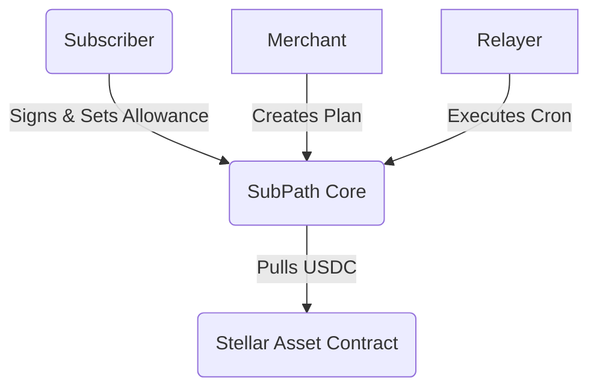

# 🌊 SubPath Core Contracts


SubPath is a decentralized recurring billing protocol built natively on Stellar Soroban. It empowers users to subscribe to services using their preferred local stablecoin, while merchants automatically receive USDC without manual swaps or slippage risk.

This repository contains the core smart contracts written in Rust for the Soroban VM.

## 🏗 Architecture

SubPath separates subscription state enforcement from token routing, leveraging standard Soroban AMMs or Stellar Path Payments via relayers to keep the core contract lightweight and cheap.



## 🚀 Quick Start

### Prerequisites
* Rust (Edition 2021)
* `wasm32-unknown-unknown` target
* Stellar CLI

### Build
```bash
make build
```
This generates the optimized `.wasm` file in `target/wasm32-unknown-unknown/release/`.

### Test
```bash
make test
```

## 🤝 Contributing
Please see our [CONTRIBUTING.md](CONTRIBUTING.md) for details on our code of conduct, branching model, and the process for submitting Pull Requests to us.

## 🛡 Security
If you discover a vulnerability, please do NOT open a public issue. Review our [SECURITY.md](SECURITY.md) for responsible disclosure.

## ✨ Contributors
Made with [contrib.rocks](https://contrib.rocks).
<a href="https://github.com/SubPath-Protocol/subpath-contract/graphs/contributors">
  
</a>
