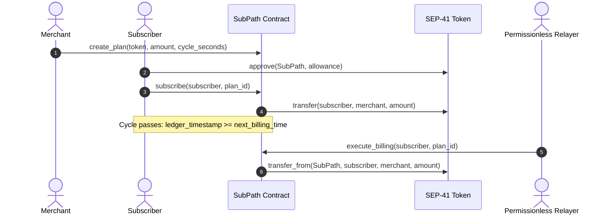

<div align="center">

# SubPath Core Contracts

**Non-custodial recurring subscription and automated billing protocol native to Stellar Soroban.**

[](https://github.com/SubPath-Protocol/subpath-contract/actions)
[](https://stellar.expert/explorer/testnet/contract/CC4ZFZ64RQ6CG3PTBNDB4A6YB7SJEW2NZ56YNNBBZVC7HDQTNIKWLUV3)
[](LICENSE)
[](https://soroban.stellar.org)
[](https://github.com/SubPath-Protocol/subpath-contract/releases)

</div>

---

## Overview

SubPath is an on-chain recurring payments protocol written in Rust for the Soroban virtual machine. The protocol enables merchants to configure token-denominated subscription plans and allows subscribers to opt into scheduled recurring payments. Recurring charges are pulled directly through pre-approved SEP-41 token allowances without custody risk, custodian lockups, or manual subscriber re-authorization for each billing cycle.

---

## Testnet Deployment

The core smart contract is deployed and verified on Stellar Testnet:

* **Contract ID**: [`CC4ZFZ64RQ6CG3PTBNDB4A6YB7SJEW2NZ56YNNBBZVC7HDQTNIKWLUV3`](https://stellar.expert/explorer/testnet/contract/CC4ZFZ64RQ6CG3PTBNDB4A6YB7SJEW2NZ56YNNBBZVC7HDQTNIKWLUV3)
* **WASM Hash**: `b96d0c3dd54253e4ceec2158d9960df19613101ff62acc8f307635c61888fb49`
* **Network**: Stellar Testnet (`Test SDF Network ; September 2015`)
* **Deployer Address**: `GBOWTBFBE5DFOLVESCOQDJERT2K7BAGNOZACMYS3FIA62IXOOGS4SJQU`
* **Native Token SAC**: `CDLZFC3SYJYDZT7K67VZ75HPJVIEUVNIXF47ZG2FB2RMQQVU2HHGCYSC`
* **Verification Evidence**: Full transaction log documented in [docs/testnet-deployment.md](docs/testnet-deployment.md).

---

## Protocol Lifecycle


```mermaid
sequenceDiagram
    autonumber
    actor M as Merchant
    actor S as Subscriber
    participant C as SubPath Contract
    participant T as SEP-41 Token
    actor R as Permissionless Relayer

    M->>C: create_plan(token, amount, cycle_seconds)
    S->>T: approve(SubPath, allowance)
    S->>C: subscribe(subscriber, plan_id)
    C->>T: transfer(subscriber, merchant, amount)
    Note over S,C: Cycle passes: ledger_timestamp >= next_billing_time
    R->>C: execute_billing(subscriber, plan_id)
    C->>T: transfer_from(SubPath, subscriber, merchant, amount)
```

1. **Plan Creation**: Merchants invoke `create_plan` with token address, billing amount, and cadence (`cycle_seconds`).
2. **Allowance Approval**: Subscribers approve a token allowance for the contract on the SEP-41 token contract.
3. **Subscription**: Subscribers invoke `subscribe(subscriber, plan_id)`. The first billing cycle payment transfers immediately to the merchant.
4. **Automated Recurring Billing**: Once `ledger_timestamp >= next_billing_time`, anyone (such as the SubPath executor daemon or an open relayer) can call `execute_billing(subscriber, plan_id)`. The contract pulls the installment via `transfer_from` and updates `next_billing_time`.
5. **Subscriber Controls**: Subscribers can call `pause_subscription`, `resume_subscription`, or `cancel_subscription` at any time.

---

## Key Functions

| Method | Access | Description |
| :--- | :--- | :--- |
| `initialize(env)` | Public (once) | Initializes storage and counter sequence. |
| `create_plan(env, merchant, token, amount, cycle)` | `merchant` auth | Creates a subscription plan. |
| `subscribe(env, subscriber, plan_id)` | `subscriber` auth | Initiates a subscription and processes cycle payment #1. |
| `execute_billing(env, subscriber, plan_id)` | **Permissionless** | Collects due payment via approved token allowance. |
| `pause_subscription(env, subscriber, plan_id)` | `subscriber` auth | Temporarily halts recurring billing executions. |
| `resume_subscription(env, subscriber, plan_id)` | `subscriber` auth | Resumes a paused subscription to Active state. |
| `cancel_subscription(env, subscriber, plan_id)` | `subscriber` auth | Permanently cancels an existing subscription. |
| `get_plan(env, plan_id)` | Read-only | Returns plan details or None. |
| `get_subscription(env, subscriber, plan_id)` | Read-only | Returns subscriber status and next billing timestamp. |

---

## Events

The contract emits structured events for off-chain event indexing:

* `plan_add`: `topics: ["plan_add", merchant]`, `data: plan_id`
* `sub_new`: `topics: ["sub_new", subscriber]`, `data: plan_id`
* `sub_billed`: `topics: ["sub_billed", subscriber]`, `data: plan_id`
* `sub_pause`: `topics: ["sub_pause", subscriber]`, `data: plan_id`
* `sub_resume`: `topics: ["sub_resume", subscriber]`, `data: plan_id`
* `sub_end`: `topics: ["sub_end", subscriber]`, `data: plan_id`

See [docs/contract-reference.md](docs/contract-reference.md) for full argument and error definitions.

---

## Security & Permissionless Billing

* **Non-Custodial**: The contract never retains subscriber deposits or holds user keys. Payments flow directly from the subscriber to the merchant.
* **Bounded Pulls**: Recurring payments cannot exceed `plan.amount` per cycle, and cannot exceed the allowance explicitly authorized by the subscriber.
* **Time Guardrails**: Calls to `execute_billing` before `next_billing_time` revert with `BillingTooEarly`.
* **Audit Notice**: This prototype is unaudited and intended for Stellar Testnet evaluation. See [docs/security-model.md](docs/security-model.md).

---

## Development & Verification

### Toolchain
* Rust stable with target `wasm32v1-none`
* `stellar-cli` v28.0.0 or later

### Build & Test Commands
```bash
# Build WASM binary
stellar contract build

# Run unit tests
cargo test --workspace

# Lint and formatting checks
cargo fmt --all -- --check
cargo clippy --workspace --all-targets -- -D warnings
```

---

## Documentation Links

* [Architecture & Protocol Design](docs/architecture.md)
* [Contract Reference](docs/contract-reference.md)
* [Testnet Deployment Evidence](docs/testnet-deployment.md)
* [Security Model](docs/security-model.md)
* [Changelog](CHANGELOG.md)
* [Roadmap](ROADMAP.md)

---

## Limitations

* **Testnet Prototype**: Evaluated on Stellar Testnet only. Not audited for Mainnet financial use.
* **Allowance Dependency**: Billing execution requires that the subscriber maintains an adequate token allowance and balance.
* **Off-Chain Scheduling**: On-chain execution is permissionless, but requires an external caller (relayer or executor daemon) to trigger transactions once due.

---

## Contributing & License

Contributions are welcome. Please read [CONTRIBUTING.md](CONTRIBUTING.md), [SECURITY.md](SECURITY.md), and [CODE_OF_CONDUCT.md](CODE_OF_CONDUCT.md).

Licensed under the [MIT License](LICENSE).
