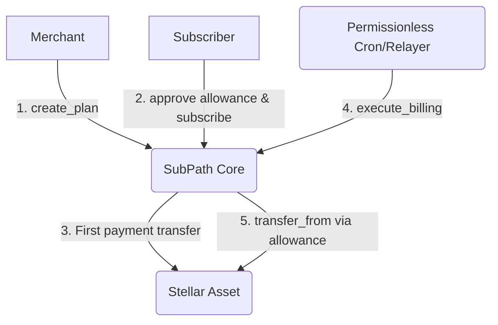

# 🌊 SubPath Core Contracts


[](https://github.com/SubPath-Protocol/subpath-contract/actions)

SubPath is a decentralized recurring billing protocol built natively on Stellar Soroban. It empowers merchants to create token-denominated subscription plans and allows subscribers to opt in with automated, permissionless recurring billing.

This repository contains the core smart contract (`subpath-core`) written in Rust for the Soroban VM.

---

## 🌐 Testnet Deployment (v0.1.0)

* **Contract ID**: [`CC4ZFZ64RQ6CG3PTBNDB4A6YB7SJEW2NZ56YNNBBZVC7HDQTNIKWLUV3`](https://lab.stellar.org/r/testnet/contract/CC4ZFZ64RQ6CG3PTBNDB4A6YB7SJEW2NZ56YNNBBZVC7HDQTNIKWLUV3)
* **Network**: Stellar Testnet
* **Deployer / Admin Address**: `GBOWTBFBE5DFOLVESCOQDJERT2K7BAGNOZACMYS3FIA62IXOOGS4SJQU`
* **WASM Hash**: `b96d0c3dd54253e4ceec2158d9960df19613101ff62acc8f307635c61888fb49`
* **Stellar Expert Explorer**: [tx/6f16e1...](https://stellar.expert/explorer/testnet/tx/6f16e1c93e583914bef7c87290499acb3879dff02e62e61e10495d83b4a47b5a)

---

## 🏗 Architecture & Core Lifecycle


```mermaid
graph TD
    Merchant -->|1. create_plan| Contract(SubPath Core)
    Subscriber -->|2. approve allowance & subscribe| Contract
    Contract -->|3. First payment transfer| Token(Stellar Asset)
    Anyone(Permissionless Cron/Relayer) -->|4. execute_billing| Contract
    Contract -->|5. transfer_from via allowance| Token
```

### Protocol Workflow
1. **Plan Creation**: Merchants create subscription plans specifying `token`, `amount`, and `cycle_seconds`.
2. **Subscription & First Payment**: Subscribers authorize subscription to a plan. The first payment is processed atomically upon subscription.
3. **Allowance & Permissionless Recurring Billing**: Subscribers approve token allowance to the SubPath Contract address. Once the billing cycle elapses (`ledger timestamp >= next_billing_time`), **anyone** (permissionless relayer or cron worker) can invoke `execute_billing(subscriber, plan_id)` to trigger the recurring token transfer.
4. **Subscription Controls**: Subscribers can pause, resume, or cancel active subscriptions.

---

## 🚀 Development & Verification

### Toolchain Requirements
* Rust (Stable toolchain) with target `wasm32v1-none`
* `stellar-cli` (v28.0.0+)

### Commands
```bash
# Build WASM contract
make build
# or: stellar contract build

# Run unit test suite
cargo test --workspace

# Check formatting and lints
cargo fmt --all -- --check
cargo clippy --workspace --all-targets -- -D warnings
```

---

## 🔒 Branch Protection & CI Checks

Pull Requests must pass the following required GitHub Action checks prior to merging to `main`:
1. `Run cargo fmt`
2. `Run clippy`
3. `Run unit tests`
4. `Build contract`

---

## 🤝 Contributing
Please see our [CONTRIBUTING.md](CONTRIBUTING.md) for contribution guidelines. Future roadmap items and contributor tasks are tracked in [`docs/backlog/`](docs/backlog/).

## 🛡 Security
* **Audit Status**: Unaudited MVP (`v0.1.0`). Provided as-is for testnet evaluation.
* Please review [SECURITY.md](SECURITY.md) to report any security concerns directly to `security@subpath-protocol.com`.

## 📜 License
Licensed under the [MIT License](LICENSE).
