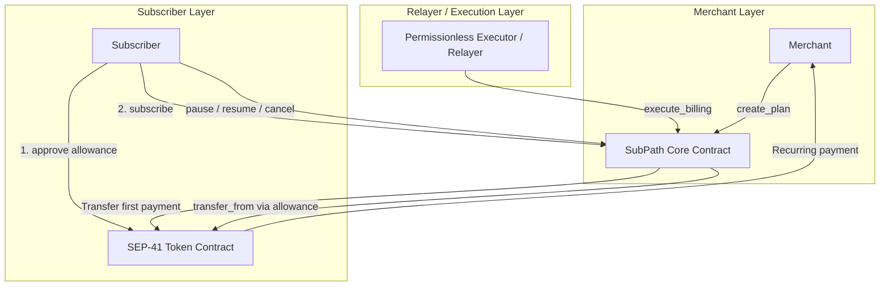
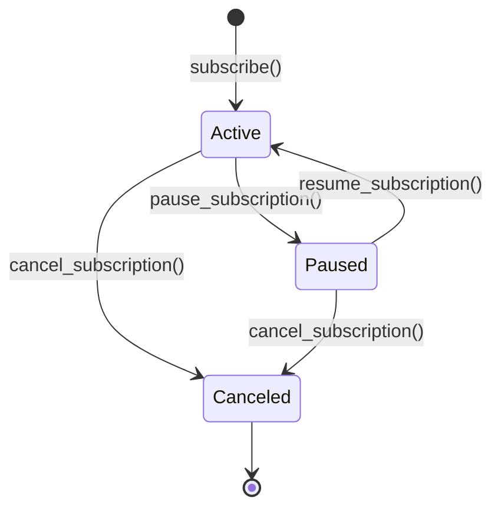

# SubPath Contract Architecture

## Overview

SubPath is a decentralized recurring billing protocol deployed on Stellar Soroban. The protocol allows merchants to configure on-chain subscription plans and enables subscribers to authorize recurring payments pulled automatically via SEP-41 token allowances.

## High-Level Architecture

## Core Protocol Workflow

1. **Plan Creation**: A merchant invokes `create_plan` with an approved payment token address, recurring amount in token base units, and recurring interval in seconds (`cycle_seconds`).
2. **Subscriber Token Approval**: Prior to or during onboarding, the subscriber approves a token spending allowance (`approve`) to the SubPath contract address on the underlying SEP-41 token contract.
3. **Subscription & Initial Payment**: The subscriber invokes `subscribe(subscriber, plan_id)`. The contract validates the plan, computes the next billing timestamp (`ledger_timestamp + cycle_seconds`), records the subscription as `Active`, and transfers the first billing payment directly to the merchant.
4. **Permissionless Automated Billing**: Once `ledger_timestamp >= next_billing_time`, any party (such as an off-chain cron relayer, indexer executor, or community node) can call `execute_billing(subscriber, plan_id)`. The contract checks status and timestamps, executes `transfer_from` against the subscriber's pre-approved allowance, and advances `next_billing_time` by `cycle_seconds`.
5. **Subscription Lifecycle Control**: Subscribers retain full custody of their keys and can independently call `pause_subscription`, `resume_subscription`, or `cancel_subscription` at any time.

## State Transition Model

* **Active**: Eligible for recurring execution once `next_billing_time` is reached.
* **Paused**: Billing invocations are rejected with `Error::SubscriptionPaused`.
* **Canceled**: Permanent terminal state. Billing invocations are rejected with `Error::SubscriptionCanceled`.

## Storage Model

The contract utilizes Soroban instance storage for global configuration and persistent storage for state records:
* `DataKey::Initialized`: Flag indicating one-time initialization.
* `DataKey::PlanCounter`: Monotonically increasing u64 sequence for plan identifiers.
* `DataKey::Plan(plan_id)`: Maps `plan_id` to `Plan { merchant, token, amount, cycle_seconds }`.
* `DataKey::Subscription(subscriber, plan_id)`: Maps subscriber address and plan ID to `Subscription { subscriber, plan_id, next_billing_time, status }`.
